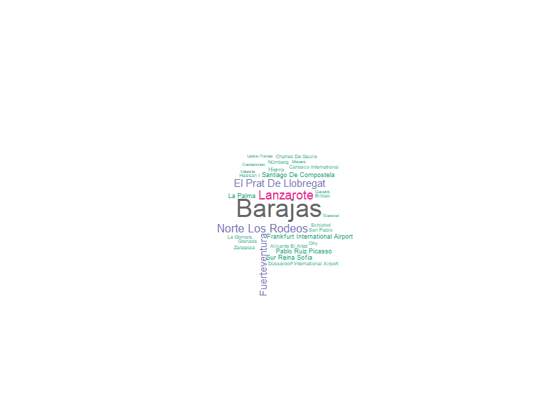

# 🌍 ✈️ CanaryAir

**CanaryAir** is a Java-based application that analyzes flight arrivals to Gran Canaria and correlates them with weather conditions. Given that the Canary Islands are one of the most popular tourist destinations in Europe, the system provides insights into the countries and regions within Spain and Europe where tourists come from, and how weather affects the volume of incoming flights. This enables weekly monitoring of air traffic and supports strategic tourism analysis.

---

## 🎯 Project Goal

To analyze the origin of tourists arriving in Gran Canaria by air, and study how weather (e.g., cloudiness, temperature, wind) influences the number of arrivals. This supports:
- Strategic tourism market research
- Historical and real-time data tracking
- Better understanding of flight patterns to the island

---

## 🧠 Design Principles

- Clean modular architecture
- Event-driven design with ActiveMQ
- Clear separation of responsibilities (fetching, storage, analysis)
- Weekly replayable data via `.events` files
- Combination of real-time and batch processing
- Visual analysis supported via R scripts

---

## 🏗️ Main Functionality

The system is structured around three key modules:

### ✈️ `MainConMiApiKey`
- Fetches flight data weekly from the [AviationStack API](https://aviationstack.com).
- Publishes each flight as an event to the ActiveMQ broker (`prediction.Flight`).

### 🛬 `SubscriberMain`
- Subscribes to the `prediction.Flight` topic.
- Stores received events into `.events` files under `eventstore/`.
- Groups events by day and source, allowing reprocessing or audits.

### 📊 `BusinessMain`
- Subscribes to the topic and reads from `.events`.
- Builds a local `datamart.db` for visualization and analysis.
- Executes statistical scripts (e.g., in R) to detect patterns in arrivals.
- Produces graphs and summaries.

---

### UML Class Diagrams

### 📊Visual Samples

## 📄 Authors

- Agustín Darío Casebonne

- Julen Mendoza